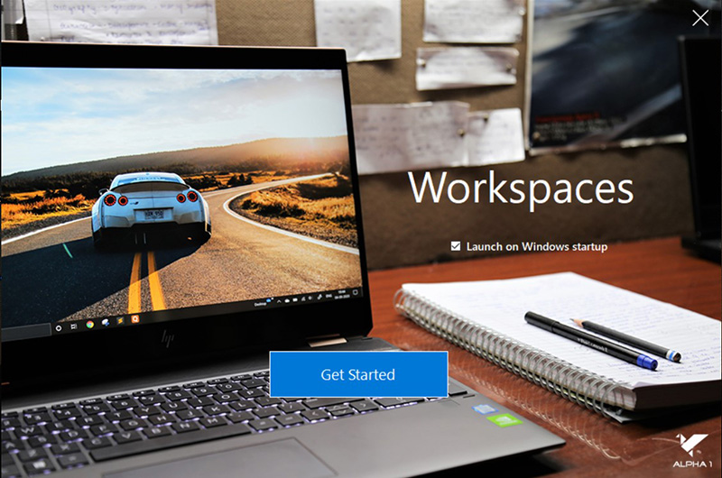
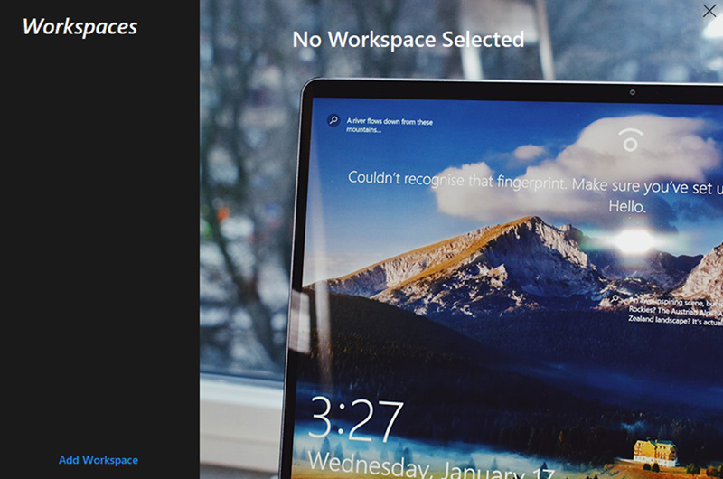
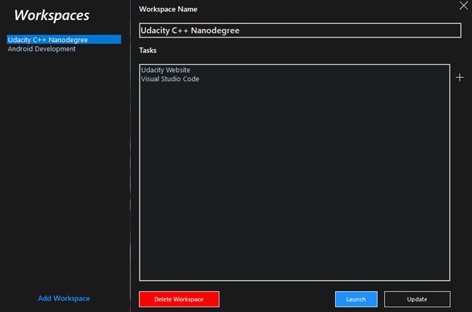
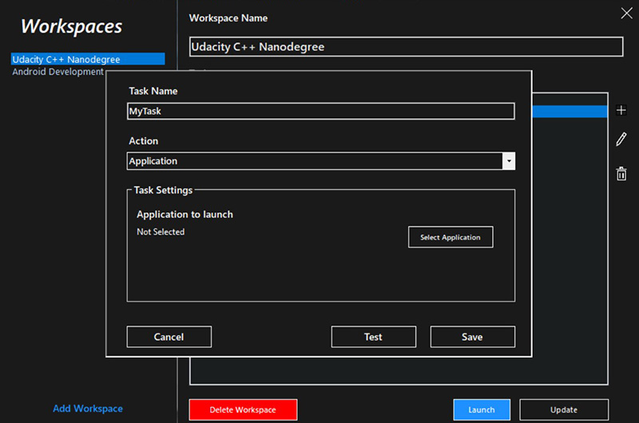

# Workspaces
A productivity tool for Microsoft Windows.

With Workspaces you are no longer required to run one by one your daily-use applications. 
All you have to do is create Workspaces as per your needs, add tasks to them and from the next time run all at once via single click.

# Screenshot
  

  

# Contribute
The application is currently under development. All kinds of contribution are accepted.
To contribute:
1. Fork this repository.
2. Make your changes and commit
3. Raise a PR explaning what you have done.

## Known Issues
  Please check the issues section. Fixing issues one by one.
  
## TODO
  1. Add CheckBox to run task as an Admin
  2. Add option to run any Command.
  3. Add option to run individual tasks.
